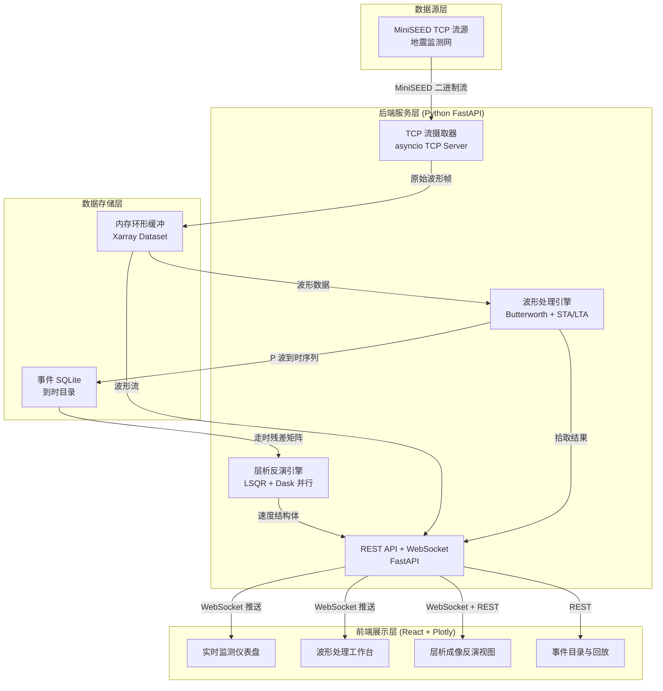
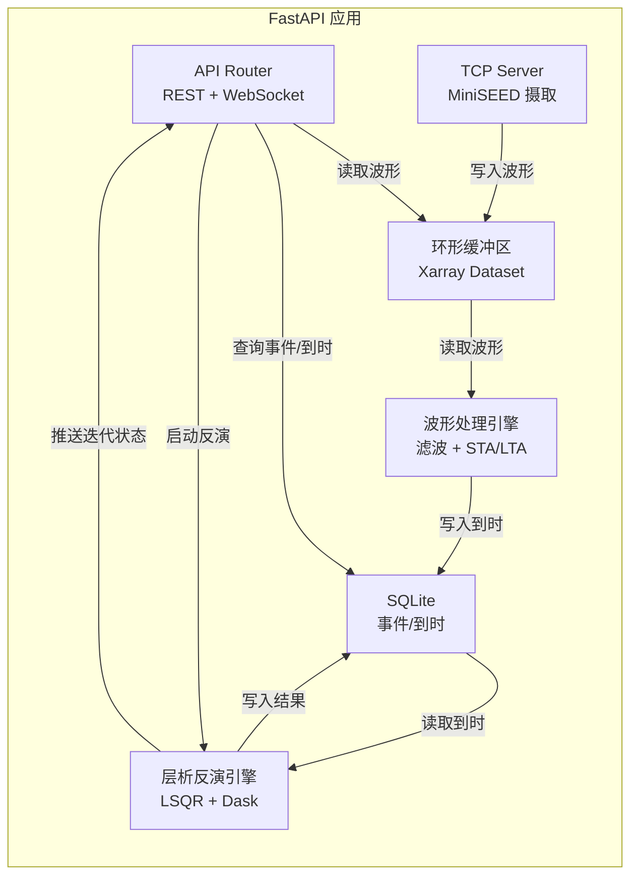
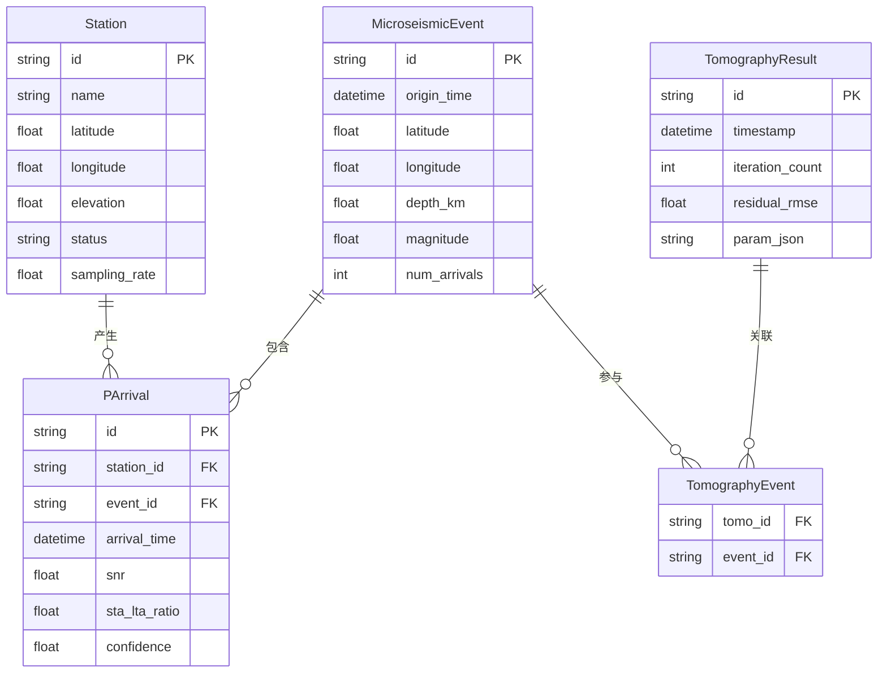

## 1. 架构设计



## 2. 技术说明

- **前端**：React@18 + TypeScript + Tailwind CSS@3 + Vite + Plotly.js（WebGL 渲染）
- **初始化工具**：Vite (react-ts 模板)
- **后端**：FastAPI + Uvicorn + asyncio（TCP 服务器）
- **科学计算栈**：Xarray + Dask + SciPy（滤波/插值）+ scikit-sparse（LSQR）+ obspy（MiniSEED 解包）
- **数据库**：SQLite（事件目录/到时表），内存 Xarray Dataset（波形环形缓冲）
- **通信**：REST API（查询/配置）+ WebSocket（实时推送波形/反演状态）

## 3. 路由定义

| 路由 | 用途 |
|------|------|
| `/` | 重定向至仪表盘 |
| `/dashboard` | 实时监测仪表盘 |
| `/waveform` | 波形处理工作台 |
| `/tomography` | 层析成像反演视图 |
| `/events` | 事件目录与回放 |

## 4. API 定义

### 4.1 REST API

```typescript
interface Station {
  id: string;
  name: string;
  latitude: number;
  longitude: number;
  elevation: number;
  status: "online" | "offline";
  sampling_rate: number;
  last_arrival: string | null;
}

interface WaveformSegment {
  station_id: string;
  channel: string;
  start_time: string;
  end_time: string;
  sampling_rate: number;
  data: number[];
}

interface PArrival {
  id: string;
  station_id: string;
  event_id: string;
  arrival_time: string;
  snr: number;
  sta_lta_ratio: number;
  confidence: number;
}

interface MicroseismicEvent {
  id: string;
  origin_time: string;
  latitude: number;
  longitude: number;
  depth_km: number;
  magnitude: number;
  num_arrivals: number;
}

interface TomographyResult {
  id: string;
  event_ids: string[];
  grid_shape: [number, number, number];
  grid_origin: [number, number, number];
  grid_spacing: [number, number, number];
  velocity_model: number[];
  iteration_count: number;
  residual_rmse: number;
  timestamp: string;
}

interface FilterParams {
  freq_low: number;
  freq_high: number;
  order: number;
}

interface TomographyParams {
  grid_nx: number;
  grid_ny: number;
  grid_nz: number;
  damping: number;
  max_iterations: number;
  convergence_threshold: number;
}
```

**端点列表：**

| 方法 | 路径 | 描述 |
|------|------|------|
| GET | `/api/stations` | 获取台站列表与状态 |
| GET | `/api/waveform` | 获取波形数据段（查询参数: station_id, start, end, channel） |
| GET | `/api/arrivals` | 获取 P 波到时列表 |
| GET | `/api/events` | 获取微震事件目录 |
| GET | `/api/tomography/{id}` | 获取反演结果 |
| POST | `/api/filter/config` | 更新滤波器参数 |
| POST | `/api/tomography/start` | 启动层析反演 |
| POST | `/api/tomography/stop` | 停止反演 |

### 4.2 WebSocket 通道

| 通道 | 推送内容 | 推送频率 |
|------|----------|----------|
| `/ws/waveform` | 实时波形数据帧 | 按采样率节流（~100ms） |
| `/ws/arrivals` | 新 P 波到时通知 | 事件触发 |
| `/ws/tomography` | 反演迭代进度、收敛值、中间等值面 | 每次迭代 |

## 5. 服务端架构图



## 6. 数据模型

### 6.1 数据模型定义



### 6.2 数据定义语言

```sql
CREATE TABLE station (
    id TEXT PRIMARY KEY,
    name TEXT NOT NULL,
    latitude REAL NOT NULL,
    longitude REAL NOT NULL,
    elevation REAL NOT NULL,
    status TEXT NOT NULL DEFAULT 'offline',
    sampling_rate REAL NOT NULL DEFAULT 1000.0
);

CREATE TABLE microseismic_event (
    id TEXT PRIMARY KEY,
    origin_time TEXT NOT NULL,
    latitude REAL NOT NULL,
    longitude REAL NOT NULL,
    depth_km REAL NOT NULL,
    magnitude REAL,
    num_arrivals INTEGER NOT NULL DEFAULT 0
);

CREATE TABLE p_arrival (
    id TEXT PRIMARY KEY,
    station_id TEXT NOT NULL REFERENCES station(id),
    event_id TEXT NOT NULL REFERENCES microseismic_event(id),
    arrival_time TEXT NOT NULL,
    snr REAL,
    sta_lta_ratio REAL,
    confidence REAL
);

CREATE TABLE tomography_result (
    id TEXT PRIMARY KEY,
    timestamp TEXT NOT NULL,
    iteration_count INTEGER NOT NULL,
    residual_rmse REAL NOT NULL,
    param_json TEXT NOT NULL
);

CREATE TABLE tomography_event (
    tomo_id TEXT NOT NULL REFERENCES tomography_result(id),
    event_id TEXT NOT NULL REFERENCES microseismic_event(id),
    PRIMARY KEY (tomo_id, event_id)
);

CREATE INDEX idx_arrival_station ON p_arrival(station_id);
CREATE INDEX idx_arrival_event ON p_arrival(event_id);
CREATE INDEX idx_event_time ON microseismic_event(origin_time);
```
